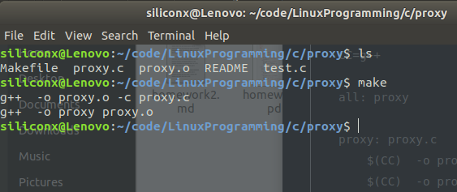
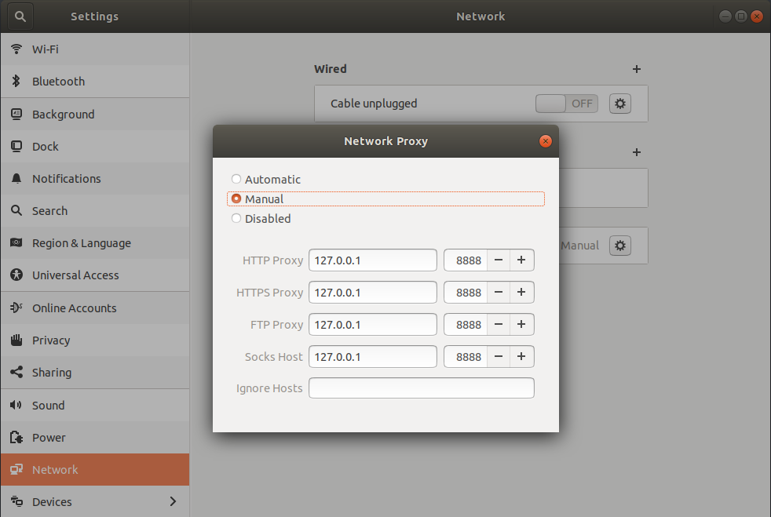
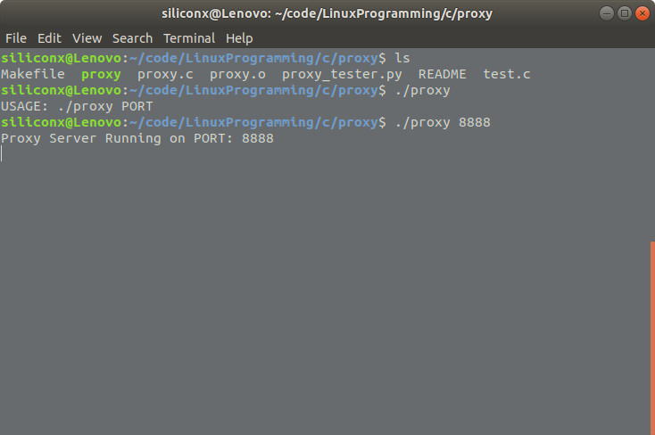
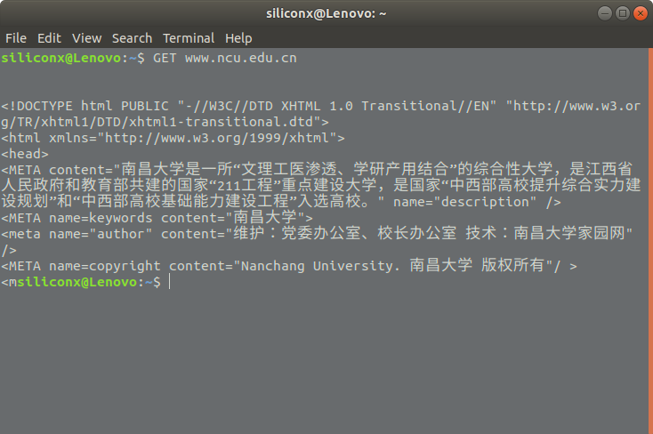
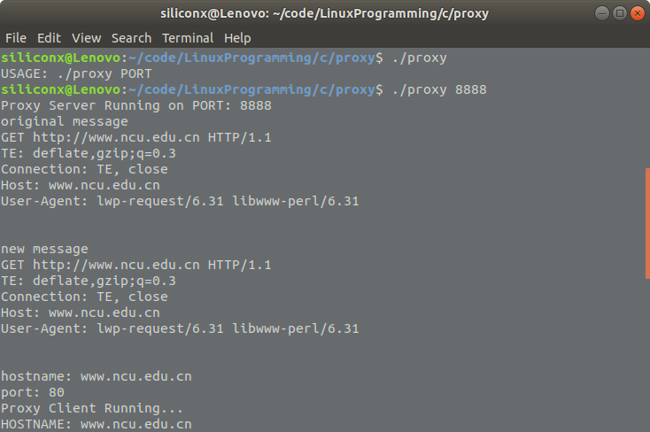

# Homework3

<p style="text-align: right">--计科153、谢志彬、6103115112</p>


## Q: HTTP代理


#### 0x01 原理分析


####0x02 编写源码

I.proxy.c

> 由proxy_server负责接收客户端的请求，再由proxy_client负责把客户端的请求发送给服务器。
> 在中转请求的时候，需要提取请求的信息，如 域名 端口号等，这就需要用到正则表达式

```c++
// Server Side
#include <iostream>
#include <string>
#include <regex>  // 正则

#include <unistd.h>
#include <stdio.h>
#include <stdlib.h>
#include <string.h>
#include <sys/socket.h>
#include <netinet/in.h>
#include <arpa/inet.h>  // inet_ntop/inet_pton
#include <netdb.h>  // gethostbyname

#define STR_SIZE 640
#define BUFFER_SIZE 40960

using namespace std;

int proxy_server(int);
string proxy_client(string, int, string);
struct proxy_info rewrite_header(string);

struct proxy_info {
    string msg;
    string hostname;
    int port;
};

int main(int argc, char const *argv[]) {
   while(1) {
        proxy_server();
    }

    return 0;
}

int proxy_server(int port) {
    /*
    * 代理服务器，负责接收客户端的请求
    * 并把请求转发到proxy_client
    */
    printf("Proxy Server Running on PORT: %d\n", port);
    int server_fd, tcp_socket, valread;
    struct sockaddr_in address;
    int opt = 1;
    int addrlen = sizeof(address);
    int msg_len = 0;  // message length

    char* temp_msg = (char*) malloc(BUFFER_SIZE * sizeof(char));  // request message
    string request;
    string response = "HTTP/1.1 200 OK\r\nCache-Control: no-cache, private\r\n\r\nhello";  // Response string

    // socket file descriptor
    if ((server_fd = socket(AF_INET, SOCK_STREAM, 0)) == 0) {
        perror("socket failed");
        exit(EXIT_FAILURE);
    }

    // Forcefully attaching socket to the port
    if (setsockopt(server_fd, SOL_SOCKET, SO_REUSEADDR | SO_REUSEPORT, &opt, sizeof(opt))) {
        perror("setsockopt");
        exit(EXIT_FAILURE);
    }

    address.sin_family = AF_INET;
    address.sin_addr.s_addr = INADDR_ANY;
    address.sin_port = htons(port);

    // attaching socket to the port
    if (bind(server_fd, (struct sockaddr *)&address, sizeof(address)) < 0) {
        perror("bind failed");
        exit(EXIT_FAILURE);
    }

    if (listen(server_fd, 3) < 0) {
        perror("listen");
        exit(EXIT_FAILURE);
    }

    if ((tcp_socket = accept(server_fd, (struct sockaddr *)&address, (socklen_t*)&addrlen)) < 0) {
        perror("accept");
        exit(EXIT_FAILURE);
    }

    valread = read(tcp_socket, temp_msg, BUFFER_SIZE);
    request = temp_msg;
    free(temp_msg);

    fflush(stdout);

    // replace request message, which has proxy information
    struct proxy_info new_info = rewrite_header(request);

    // resend request to real server
    response = proxy_client(new_info.hostname, new_info.port, new_info.msg);

    // string str = "GET / HTTP/1.1\r\nHost: 119.29.148.227\r\nProxy-Connection: keep-alive\r\nUser-Agent: Mozilla/5.0 (X11; Linux x86_64) AppleWebKit/537.36 (KHTML, like Gecko) Ubuntu Chromium/67.0.3396.62 Chrome/67.0.3396.62 Safari/537.36\r\n\r\n";
    // response = proxy_client("119.29.148.227", 80, str);

    send(tcp_socket, response.c_str(), (int) response.length(), 0);
    close(tcp_socket);

    cout << "===========respones===========\n" << response << endl;

    return 0;
}

string proxy_client(string host, int port, string request) {
    /**
    * 代理客户端，充当客户端给服务器发送请求
    * 并转发相应
    */
    printf("Proxy Client Running...\n");
    int sock = 0, valread;
    struct sockaddr_in serv_addr;
    char **pptr;
    struct hostent *hptr;

    char ip[STR_SIZE];  // ip address
    char* temp_msg = (char*) malloc(BUFFER_SIZE * sizeof(char));
    string response;

    // Convert HOSTNAME to IP
    if ((hptr = gethostbyname(host.c_str())) == NULL) {
        fprintf(stderr, " gethostbyname error for host: %s\n", host.c_str());
        return NULL;
    }
    printf("HOSTNAME: %s\n", hptr->h_name);

    if (hptr->h_addrtype == AF_INET
        && (pptr = hptr->h_addr_list) != NULL) {
            inet_ntop(hptr->h_addrtype, *pptr, ip, sizeof(ip));
    } else {
        fprintf(stderr, "Error call inet_ntop \n");
    }

    printf("IP: %s\nPORT: %d\n", ip, port);

    // Create socket
    if ((sock = socket(AF_INET, SOCK_STREAM, 0)) < 0) {
        printf("\n Socket create failed \n");
        return NULL;
    }
    printf("\n Socket created \n");

    memset(&serv_addr, '0', sizeof(serv_addr));

    serv_addr.sin_family = AF_INET;
    serv_addr.sin_port = htons(port);

    // Convert IP addresses from text to binary form
    if(inet_pton(AF_INET, ip, &serv_addr.sin_addr) <= 0) {
        printf("\n Invalid address \n");
        return NULL;
    }

    if (connect(sock, (struct sockaddr *)&serv_addr, sizeof(serv_addr)) < 0) {
        printf("\n Connection Failed \n");
        return NULL;
    }
    printf("\n Connected \n");

    send(sock, request.c_str(), (int) request.length(), 0);
    valread = read(sock ,temp_msg, 1024);
    close(sock);
    response = temp_msg;
    free(temp_msg);

    return response;
}


struct proxy_info rewrite_header(string original_msg) {
    string new_msg;
    string full_host;
    string hostname;
    string port = "80";
    struct proxy_info rewrite_data;

    regex extra_host_re("Host: (.*)\r\n");  // regex for extra HOST
    regex replace_re("CONNECT.*\r\n");  // regex for replace line with `CONNECT`
    regex split_re("(.*):(\\d*)");  // split hostname and port
    smatch sm;  // 存放string结果的容器

    regex_search(original_msg, sm, extra_host_re);
    if (sm.size() > 1) {
        hostname = full_host = sm[1];
    }

    if (!full_host.empty()) {
        regex_search(full_host, sm, split_re);
        if (sm.size() > 2) {
            hostname = sm[1];
            port = sm[2];
        }
    }

    // 去除请求头的CONNECT行
    new_msg = regex_replace(original_msg, replace_re, "");

    rewrite_data.msg = new_msg;
    rewrite_data.hostname = hostname;
    rewrite_data.port = atoi(port.c_str());

    cout << "original message\n" << original_msg << endl;
    cout << "new message\n" << rewrite_data.msg << endl;
    cout << "hostname: " << rewrite_data.hostname << endl;
    cout << "port: " << rewrite_data.port << endl;

    return rewrite_data;
}

```


II.makefile

```
CC=g++

all: proxy

proxy: proxy.c
    $(CC)  -o proxy.o -c proxy.c
    $(CC)  -o proxy proxy.o

clean:
    rm -f proxy *.o

```


#### 0x03 编译

```bash
make
```




#### 0x04 设置电脑的网络代理




#### 0x05 重启 && 运行代理程序




#### 0x06 发送http请求

​	a.在命令行执行GET命令




​	b.代理程序的输出


